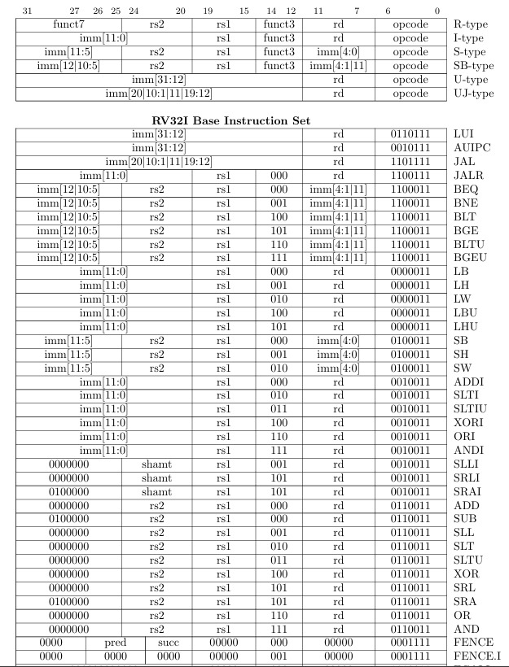
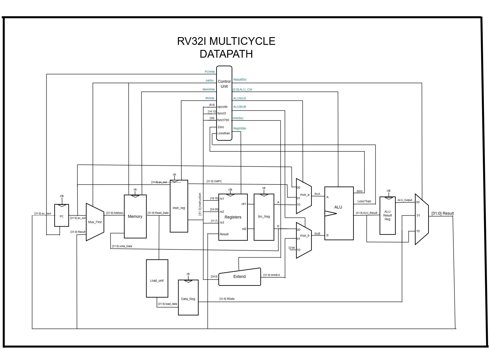
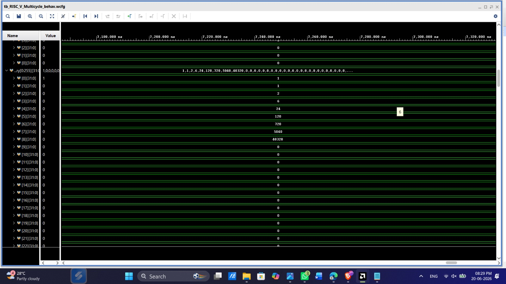

# RV32I RISC-V Processor Core (Verilog) — Multicycle Implementation

# Project Overview

Welcome! This project is a personal journey into the heart of computer architecture. Having successfully built the Single-Cycle variant, I have advanced the core into a fully synthesizable **Multicycle 32-bit RISC-V (RV32I)** processor core from the ground up using Verilog HDL.

By transitioning to a multicycle architecture, the design breaks down instruction execution into distinct, smaller steps per clock cycle. This allows the core to share hardware resources (like using a single unified memory for both instructions and data) and paves the way for a much higher maximum clock frequency ($F_{max}$).

The design is heavily inspired by the architectural blueprints in **"Digital Design and Computer Architecture (RISC-V Edition)" by Sarah L. Harris and David Money Harris**. It is a fully synthesizable core developed and tested targeting FPGA workflows.

---

# Key Features

* **Complete RV32I Base Set:** Supports all 39 instructions (Arithmetic, Logical, Branching, Memory, and Jumps).
* **Resource Optimization:** Features unified instruction and data memory, sharing a single memory interface to reduce hardware overhead.
* **Modular FSM Controller:** Built with a clean Finite State Machine (FSM) control unit that coordinates multi-step instruction execution.
* **FPGA Ready:** Developed and optimized for hardware synthesis using modern FPGA design flows.
* **Verified Hardware:** Functional correctness confirmed through instruction-level verification.

---

# The Instruction Set

The core handles the full 39-instruction suite of the RV32I specification:

* **Math:** `ADD`, `SUB`, `AND`, `OR`, `XOR`, `SLT` (+ Immediate versions)
* **Shifts:** `SLL`, `SRL`, `SRA` (+ Immediate)
* **Memory:** `LW` (Load Word) and `SW` (Store Word)
* **Flow Control:** `BEQ`, `BNE`, `BLT`, `BGE`, `JAL`, `JALR`
* **Upper Immediates:** `LUI`, `AUIPC`

> These are the supported instructions with address mapping:

---

### 🧱 Architecture

This repository features the **Multicycle implementation**. Execution is split across multiple clock cycles (Fetch, Decode, Execute, Memory Access, and Writeback) using non-blocking internal registers to hold state between cycles.

> **Visualizing the Core:**
> Below is the block diagram used to map out the state registers, unified memory interface, and routing between the Program Counter, Register File, and ALU.

### 🧪 Verification (How I know it works)

I believe hardware is only as good as its verification. This entire design was simulated, analyzed, and verified using **AMD Xilinx Vivado**.

* **Instruction-level testing:** Every state transition and instruction execution path has been rigorously tested using testbenches to track register and memory state changes.
* **Waveform Analysis:** Monitored the FSM state changes, internal temporary registers, ALU results, and memory read/write cycles directly within the Vivado simulator to eliminate timing hazards.

> Below are the waveform results captured from Vivado:

> **Factorial Program Execution Results**
> The core's mathematical functionality and loop handling have been successfully verified by executing a Factorial computation program.

### 🚀 What's Next? (The Roadmap)

This project is evolving! Now that the single-cycle and multicycle foundations are solid, I am shifting focus toward high-performance pipelines:

* **[In Progress] 5-Stage Pipelining:** Moving to a classic simultaneous `Fetch -> Decode -> Execute -> Memory -> Writeback` pipeline to achieve an ideal CPI closer to 1.
* **[Planned] Hazard Handling:** Adding Forwarding and Stalling logic to handle Data and Control hazards inherent to pipelining.

---

### ACKNOWLEDGEMENT

A huge thank you to **Sarah and David Harris** for their incredible textbook. It served as the perfect structural roadmap for this implementation.
